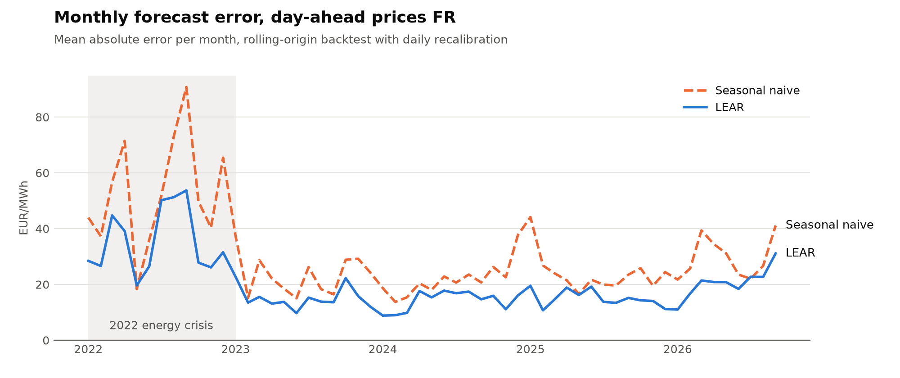
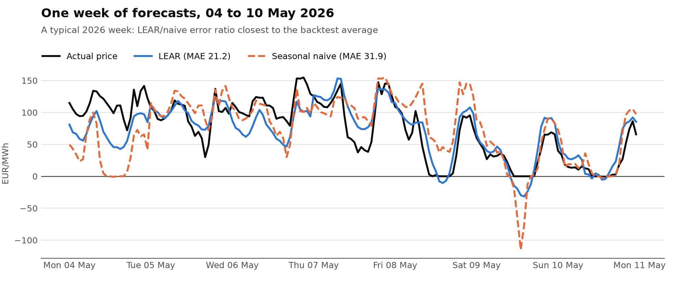

# fr-power-forecast

[](https://github.com/rayaneferr/fr-power-forecast/actions/workflows/ci.yml)

**Do time series foundation models beat market-specific models on French day-ahead electricity prices?**

This project benchmarks zero-shot and fine-tuned time series foundation models (Chronos-2, TimesFM,
Moirai) against the established electricity price forecasting baselines (seasonal naive, LEAR,
LightGBM, N-HiTS) on the EPEX-FR day-ahead market, along three axes:

1. **Accuracy**: MAE, rMAE, with Diebold-Mariano tests for statistical significance.
2. **Uncertainty**: quantile forecasts scored with pinball loss / CRPS, interval coverage, and
   conformal calibration on top.
3. **Cost of use**: inference latency and compute cost per forecast, plus a battery arbitrage
   backtest that turns forecast error into euros.

Results are broken down by market regime (pre-2022, 2022 energy crisis, negative-price hours).

## Results so far

Rolling-origin backtest over 1,734 days (January 2022 to September 2026), each day forecast with
the information available at gate closure the day before. Foundation models come next (v0.5).

| Period | Days | Seasonal naive MAE | LEAR MAE | LEAR rMAE |
|---|---:|---:|---:|---:|
| 2022-2026 | 1,734 | 30.37 | **20.09** | **0.662** |
| 2022 (energy crisis) | 365 | 52.97 | **35.53** | **0.671** |
| 2023-2026 | 1,369 | 24.34 | **15.97** | **0.656** |

MAE in EUR/MWh; rMAE is the MAE relative to the naive benchmark. LEAR is recalibrated every day;
the gain over naive is significant in every period (Diebold-Mariano p < 1e-15). Both models were
last recalibrated on data up to **2026-09-29**: later days need a recalibration
(`fr-power-forecast backtest --resume`) to be included.

<picture>
  <source media="(prefers-color-scheme: dark)" srcset="docs/img/monthly_mae_dark.png">
  
</picture>

LEAR cuts the error by about a third in both regimes: the absolute MAE drops with price levels
after 2022, the relative gain does not.

<picture>
  <source media="(prefers-color-scheme: dark)" srcset="docs/img/sample_week_dark.png">
  
</picture>

Negative-price hours around solar noon remain the hardest case for both models. LightGBM is
implemented but not backtested yet. Full protocol and cost figures: [docs/backtest.md](docs/backtest.md).
Figures are regenerated with `uv run --group plots python scripts/plot_results.py`.

## Protocol

The evaluation follows the best practices of
[Lago et al. (2021)](https://arxiv.org/abs/2008.08004): rolling-origin backtest, daily
recalibration, forecasts of the 24 hourly prices of day D+1 issued with the information available
at gate closure on day D.

## Roadmap

- [x] **v0.1** Evaluation metrics (MAE, rMAE, pinball, CRPS, coverage, Diebold-Mariano)
- [x] **v0.2** Data pipeline ([details](docs/data.md)): Energy-Charts prices, RTE load
      forecast, Open-Meteo weather (keyless), optional ENTSO-E, DST-safe hourly alignment
- [x] **v0.3** Baselines ([details](docs/models.md)): seasonal naive, LEAR, LightGBM
- [x] **v0.4** Rolling-origin backtest engine ([results](docs/backtest.md))
- [ ] **v0.5** Foundation models, zero-shot (Chronos-2, TimesFM 3.0, Moirai): wrappers done,
      backtests pending
- [ ] **v0.6** Conformal calibration of the quantile forecasts
- [ ] **v0.7** Battery arbitrage backtest (EUR value of forecasts)
- [ ] **v0.8** Fine-tuned Chronos-2 on EPEX-FR
- [ ] **v1.0** Report, Hugging Face dataset and live leaderboard

## Development

```bash
uv sync                # macOS: LightGBM needs `brew install libomp`
uv run pytest
uv run ruff check && uv run ruff format --check
```

## References

- Lago, Marcjasz, De Schutter, Weron (2021). *Forecasting day-ahead electricity prices: A review of
  state-of-the-art algorithms, best practices and an open-access benchmark.* Applied Energy 293.
  [arXiv:2008.08004](https://arxiv.org/abs/2008.08004)
- Ansari et al. (2025). *Chronos-2: From Univariate to Universal Forecasting.*
  [arXiv:2510.15821](https://arxiv.org/abs/2510.15821)
- Shchur et al. (2025). *fev-bench: A Realistic Benchmark for Time Series Forecasting.*
  [arXiv:2509.26468](https://arxiv.org/abs/2509.26468)
- Aksu et al. (2024). *GIFT-Eval: A Benchmark For General Time Series Forecasting Model
  Evaluation.* [arXiv:2410.10393](https://arxiv.org/abs/2410.10393)
- Diebold, Mariano (1995). *Comparing Predictive Accuracy.* Journal of Business & Economic
  Statistics 13(3).

## License

MIT
